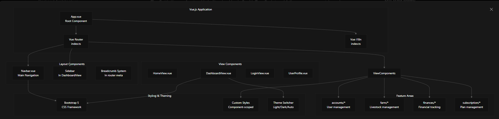
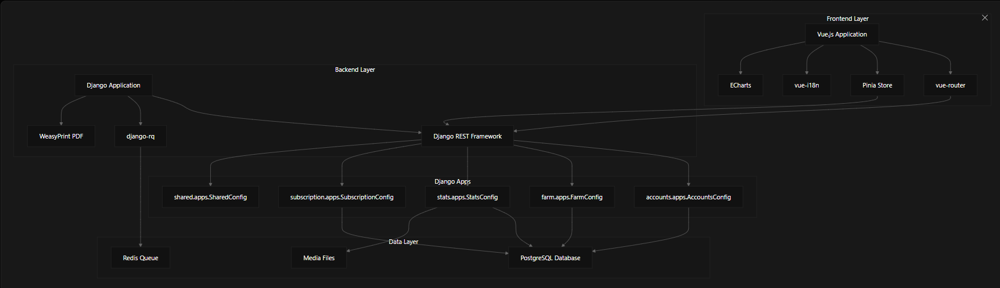
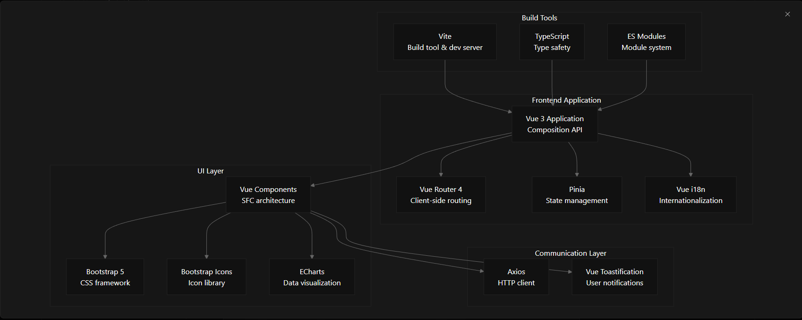
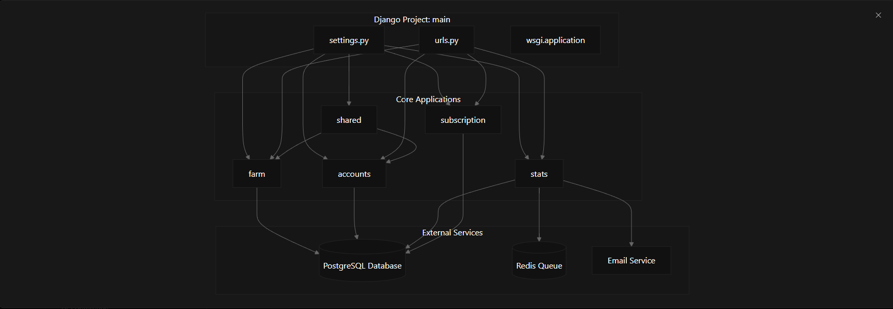
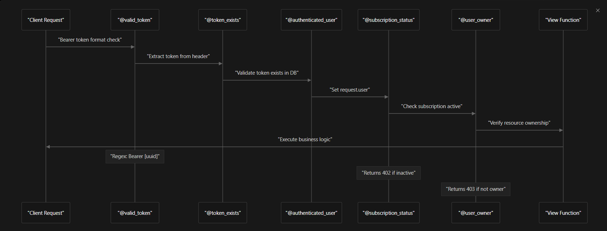
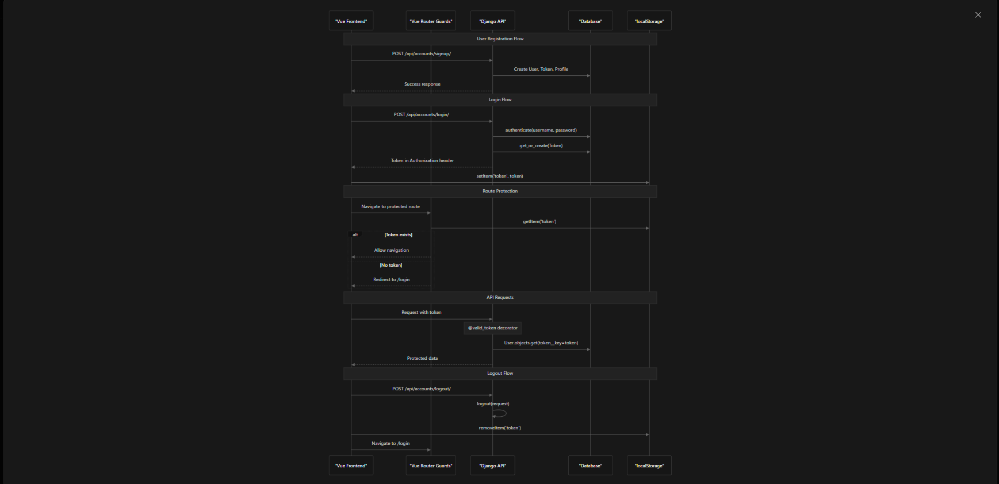

# CattleKeeper

**CattleKeeper** es una aplicación web completa para la gestión de granjas ganaderas que permite a los ganaderos controlar animales, producción, finanzas y generar reportes a través de un modelo de suscripción.

---

## 🐄 Guía de Uso de CattleKeeper

**CattleKeeper** es una solución diseñada para facilitar la administración integral de una granja ganadera. Permite llevar un control detallado del inventario de animales, supervisar eventos de salud, gestionar ingresos y gastos, y visualizar toda la información relevante a través de una interfaz intuitiva y centralizada.

### 🔐 Acceso a la Aplicación

#### Inicio de Sesión

Los usuarios deben autenticarse para acceder a las funcionalidades de la aplicación. El sistema permite iniciar sesión con correo electrónico y contraseña, o registrarse si aún no se dispone de una cuenta. Una vez autenticado, el usuario accede a su información personalizada y asociada a su perfil de granja.

#### Navegación Principal

La barra de navegación se adapta al estado de autenticación del usuario para ofrecer una experiencia personalizada:

* **Si el usuario no está autenticado**, se muestran opciones básicas como Inicio y Login.
* **Si el usuario está autenticado**, se habilita el acceso completo a:

  * Dashboard (Panel principal)
  * Mapa interactivo de la granja
  * Menú "Granja" (gestión de lotes, ingresos y gastos)
  * Menú "Perfil" (información de cuenta y suscripción)

### 🧭 Dashboard Principal

Tras iniciar sesión, el usuario accede a un panel central con indicadores clave sobre su granja. Este panel ofrece información gráfica y numérica que permite conocer el estado general de los animales, la situación financiera y otras métricas de interés.

Desde esta vista, se puede navegar fácilmente a las secciones principales como la lista de lotes, el mapa interactivo y el módulo de finanzas.

### 🐮 Gestión de Animales y Lotes

La gestión de animales se realiza tanto a nivel individual como grupal (lotes). Cada animal cuenta con un perfil completo donde se registran eventos médicos, historial de alimentación y datos de producción.

Además, los animales se organizan por lotes para facilitar el control masivo, permitiendo:

* Crear y editar lotes
* Registrar eventos de salud
* Consultar el historial de cada grupo

### 💰 Gestión Financiera

La plataforma incluye un sistema financiero integrado que permite a los usuarios registrar y monitorizar sus gastos e ingresos:

* Los **gastos** pueden categorizarse y asociarse a lotes específicos
* Los **ingresos** incluyen origen, cantidad y notas adicionales
* Los datos pueden consultarse mediante gráficos y filtros temporales, y pueden ser exportados mediante reportes en PDF

### 🌐 Características Adicionales

* **Mapa interactivo**: Visualiza zonas de la granja con representación gráfica y detalles al pasar el cursor
* **Soporte multilingüe**: Disponible en español e inglés, con selector de idioma accesible
* **Estadísticas dinámicas**: Gráficos actualizados en tiempo real sobre producción y finanzas

### Visión de componentes

---

## ⚙️ Arquitectura del Sistema

La arquitectura de **CattleKeeper** está diseñada para garantizar un rendimiento eficiente y una escalabilidad adecuada, dividiendo claramente las responsabilidades entre el frontend y el backend, lo que facilita su mantenimiento y evolución futura.

## Flujo general de la aplicación

### Frontend (Vue.js 3)

El frontend está construido sobre Vue.js 3 con TypeScript, proporcionando una experiencia de usuario ágil y moderna. Utiliza `vue-router` para manejar el enrutamiento dentro de la aplicación, y `Pinia` para la gestión del estado global, lo que permite que los datos y la UI se mantengan sincronizados y reactivos.

El diseño responsivo se logra gracias a Bootstrap 5, garantizando una experiencia óptima en distintos dispositivos y resoluciones. Para la visualización de datos y gráficos, se integra ECharts, lo que permite mostrar información financiera y de producción de forma clara y dinámica.

Además, el sistema de internacionalización (i18n) soporta tanto español como inglés, permitiendo que los usuarios puedan cambiar de idioma sin perder contexto, mejorando la accesibilidad y alcance de la aplicación.

#### Flujo del frontend

### Backend (Django)

En el backend, **CattleKeeper** se apoya en Django, utilizando Django REST Framework para construir una API REST robusta y segura. La base de datos PostgreSQL es la encargada de almacenar toda la información persistente, garantizando integridad y rapidez en las consultas.

Para las tareas que requieren procesamiento en segundo plano, como la generación de reportes en PDF o el envío de correos, se utiliza Redis como sistema de colas, gestionado mediante Django-RQ. Esta arquitectura permite que las operaciones que no son inmediatas se ejecuten sin afectar la respuesta del servidor.

La generación de reportes en formato PDF se realiza con WeasyPrint, permitiendo exportar información financiera y de producción en documentos profesionales listos para impresión o envío.

---

## 🔑 Funcionalidades Principales

### Gestión de Animales y Lotes

El sistema proporciona un control detallado de cada animal registrado, almacenando su historial médico, registros de producción y controles de alimentación. Los animales pueden ser agrupados en lotes para facilitar la gestión y seguimiento. Además, los eventos de salud, tales como vacunaciones, chequeos y tratamientos, se registran y pueden ser consultados para mantener un control riguroso.

### Sistema de Producción y Finanzas

**CattleKeeper** no solo gestiona animales, sino que también administra toda la producción generada, ya sea leche, carne, lana u otros productos. Los ingresos y gastos se controlan minuciosamente, categorizándose para facilitar el análisis financiero.

Los reportes financieros automáticos ofrecen una visión clara de la rentabilidad de la granja, ayudando a los usuarios a tomar decisiones estratégicas basadas en datos reales y actualizados.

### Sistema de Suscripciones

Para garantizar un modelo de negocio sostenible, la plataforma incorpora un sistema de suscripciones que regula el acceso a funcionalidades premium. El backend valida que los usuarios tengan una suscripción activa antes de permitir el uso de características avanzadas. Además, ofrece gestión completa de planes y pagos, integrándose con servicios de terceros para la facturación.

---

## 🔧 Características Técnicas

### Internacionalización

El soporte multilenguaje está integrado en toda la aplicación, no solo en la interfaz, sino también en la gestión de datos y reportes. Esto permite que la aplicación sea utilizada en diferentes regiones sin perder funcionalidad ni claridad.

### Autenticación y Seguridad

Se implementa un sistema robusto de autenticación basado en tokens personalizados que permiten verificar la identidad del usuario y controlar el acceso a recursos según su nivel de suscripción. Las rutas están protegidas mediante guards que evitan accesos no autorizados, y se mantiene un control estricto sobre los perfiles y permisos.

### Flujo de los tokens

### Configuración y Entorno de Desarrollo

El proyecto incluye instrucciones claras para la configuración del entorno de desarrollo, incluyendo la creación y activación de un entorno virtual de Python (`venv`), instalación de dependencias y variables de entorno para servicios externos como SMTP.
