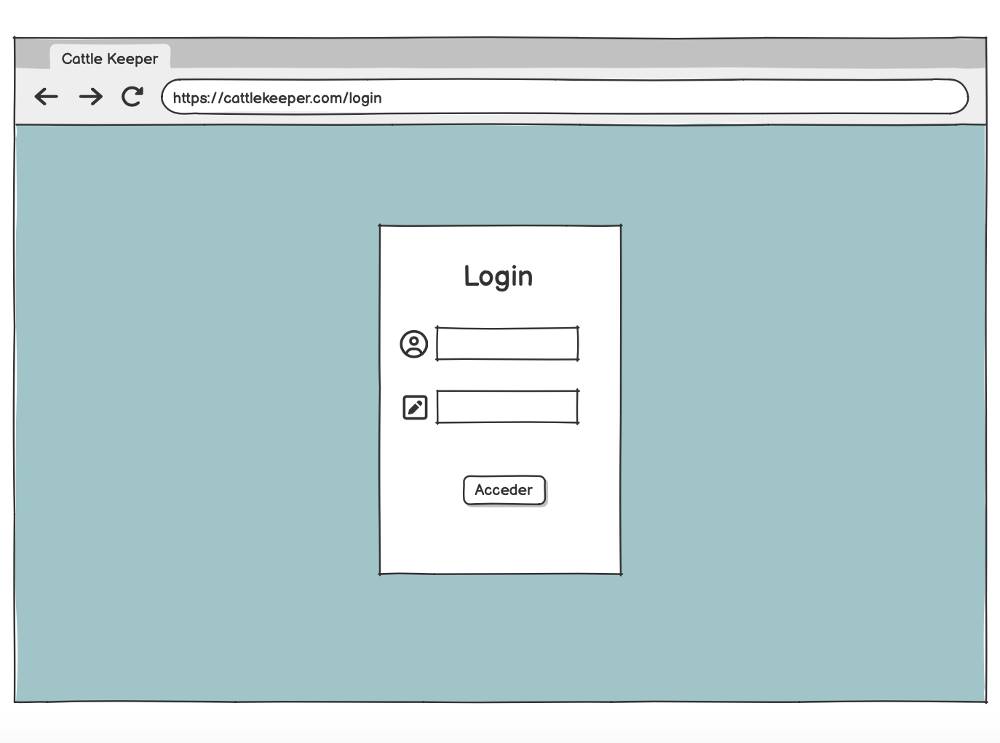
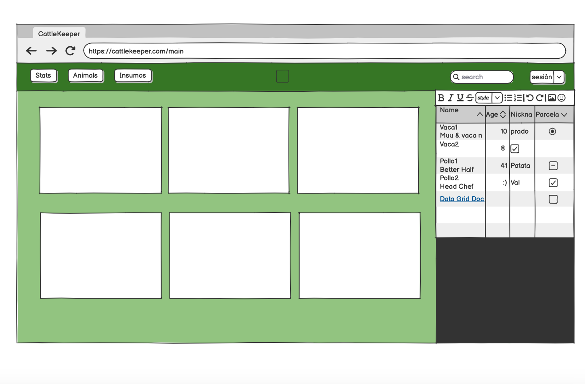
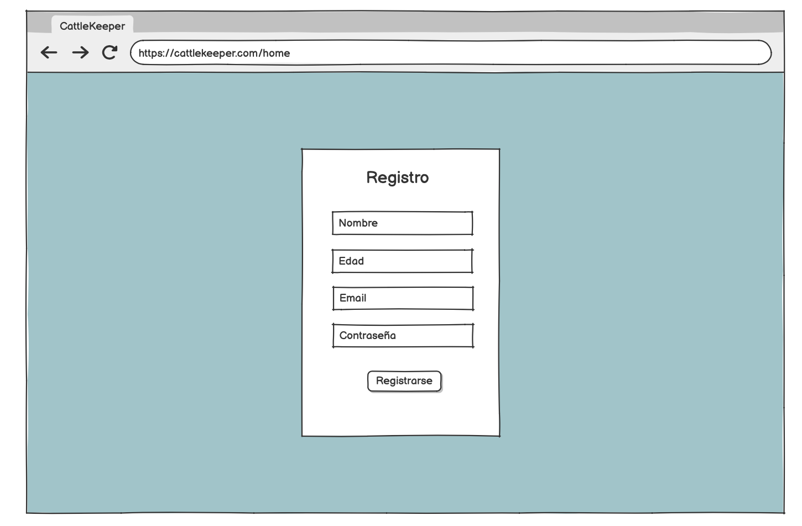

# Proyecto: Diseño de Interfaz de Usuario para Aplicación de Control de Inventario Ganadero

## Descripción de la Aplicación Web

La aplicación web propuesta se centra en la **gestión de inventario ganadero**, permitiendo a los usuarios controlar y monitorear todos los aspectos relacionados con sus animales. A través de esta plataforma, los usuarios podrán **registrar, visualizar y actualizar** información relevante sobre cada animal, como su estado de salud, alimentación, producción y otros datos importantes para su manejo eficiente.

Esta solución está orientada a pequeños y grandes ganaderos que buscan **optimizar** y **centralizar** el control de sus recursos ganaderos, con el objetivo de mejorar la toma de decisiones y aumentar la productividad.

## Wireframe

Se creará un esquema básico que mostrará la estructura de la interfaz de usuario para al menos tres pantallas de la aplicación. Las pantallas serán las siguientes:

1. **Login del Usuario** Panel de usuario típico de login para la ingresión  a la aplicación, para poder conectar sus datos almacendos en la base de datos.

2. **Vista Detallada del Main** Una página donde se muestra la información individual de un animal, incluyendo historial médico, producción de leche/carne, y controles de alimentación.

3. **Registro** Permite generar el registro de la persona en la base de datos del proyecto.

El wireframe será simple, centrándose en la disposición de los elementos. Se utilizará **Balsamiq** para su creación.

## Mockup

El mockup representará la apariencia visual de la pantalla principal de la aplicación, incluyendo:

- **Versión para escritorio, tablets y dispositivos móviles**.
- **Diseño limpio y moderno**, con colores que evoquen la naturaleza y el campo, pero sin saturar la interfaz.
- **Fuentes legibles y elegantes** que aseguren una buena experiencia de usuario.
- **Imágenes representativas** de animales y gráficos que resumen los datos del inventario de forma visual.

El mockup será creado en **Figma** para mantener la consistencia visual en todas las plataformas.

## Prototipo Interactivo

Se desarrollará un prototipo interactivo a partir de la versión de escritorio, que permitirá simular la navegación entre las principales pantallas de la aplicación. El prototipo incluirá:

- **Pantalla Principal**, donde el usuario verá un resumen del inventario ganadero.
- **Login del Usuario**, accediendo a la información individual de cada usuario.
- **Pantalla de Registro**, donde los usuarios podrán registrarse con su email y contraseña.

Este prototipo se creará utilizando **Figma**, facilitando la interacción entre las pantallas y simulando la experiencia real del usuario.

---

_**Herramientas utilizadas:**_

- **Wireframe:** Balsamiq
- **Mockup y Prototipo Interactivo:** Figma
